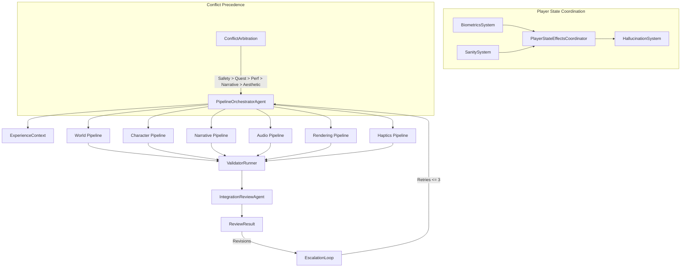

# Arkham Island — Technical Architecture Specification

> **Role:** Senior Project Engineer  
> **Project:** Arkham Island (VR Lovecraftian Horror)  
> **Engine:** Unity 6000.5.x (URP 17.x) · XR Target  
> **System Architecture:** Thermal Cascade "Why-Chain" Agent Network with Verification Layer  
> **Version:** 0.2.0-verification  

---

## Table of Contents

1. [System Architecture Overview](#1-system-architecture-overview)
2. [The Thermal Cascade Model](#2-the-thermal-cascade-model)
3. [Why-Chain Causal Intent Protocol](#3-why-chain-causal-intent-protocol)
4. [Central Orchestrator & Workflow Sequencing](#4-central-orchestrator--workflow-sequencing)
5. [Shared World-State Contract (ExperienceContext)](#5-shared-world-state-contract-experiencecontext)
6. [Agent Registry & Definitions](#6-agent-registry--definitions)
7. [Core Workflow Pipelines](#7-core-workflow-pipelines)
8. [Conflict Arbitration & Precedence Rules](#8-conflict-arbitration--precedence-rules)
9. [Deterministic Validators](#9-deterministic-validators)
10. [Independent Integration Review Agent](#10-independent-integration-review-agent)
11. [Bounded Escalation & Revision Loop](#11-bounded-escalation--revision-loop)
12. [Player State & Effects Coordinator](#12-player-state--effects-coordinator)
13. [Data Schemas & Handoff Protocol](#13-data-schemas--handoff-protocol)
14. [Unity Project Structure](#14-unity-project-structure)
15. [Map Pipeline: islandseg.glb Processing](#15-map-pipeline-islandsegglb-processing)
16. [Frame Budget & VR Constraints](#16-frame-budget--vr-constraints)
17. [Dependency Graph](#17-dependency-graph)

---

## 1. System Architecture Overview

To achieve a truly immersive VR Lovecraftian experience without breaking engine stability or performance thresholds (maintaining a strict **90 Hz / 120 Hz** frame target), we use a **Thermal Cascade Agent Architecture** governed by a central **PipelineOrchestratorAgent** and an independent **IntegrationReviewAgent**.

Instead of passing simple functional commands ("Build a bridge," "Create a monster"), our AI agents execute a **Causal Intent Protocol ("Why-Chain")**. Every handoff requires an explicit evaluation of:
- **Upstream intent** — *"Why was this sent to me?"*
- **Downstream intent** — *"Why am I passing this along?"*

```
┌──────────────────────────────────────────────────────────────────────────────────┐
│                             SYSTEM ARCHITECTURE                                  │
│                                                                                  │
│                        ┌───────────────────────────────┐                         │
│                        │    PipelineOrchestratorAgent   │                         │
│                        └───────────────┬───────────────┘                         │
│                                        │ Coordinates Context & Pipelines         │
│                                        ▼                                         │
│   ┌──────────────────────────────────────────────────────────────────────────┐   │
│   │                        THERMAL CASCADE PIPELINES                         │   │
│   │                                                                          │   │
│   │   HOT (0.85–1.1)            BALANCED (0.4–0.6)       COOL (0.0–0.2)       │   │
│   │   ┌───────────┐             ┌───────────────┐        ┌──────────────────┐│   │
│   │   │ Creative  │──── WHY ───▸│  Gameplay     │──WHY──▸│ Physics/Engine   ││   │
│   │   │ Engine    │             │  Integrator   │        │ Anchor           ││   │
│   │   └───────────┘             └───────────────┘        └──────────────────┘│   │
│   │   Dream the horror          Balance the loops        Write the math     │   │
│   └────────────────────────────────────┬─────────────────────────────────────┘   │
│                                        │                                         │
│                                        ▼                                         │
│                        ┌───────────────────────────────┐                         │
│                        │    Deterministic Validators   │                         │
│                        └───────────────┬───────────────┘                         │
│                                        │ Hard Invariant Checking                 │
│                                        ▼                                         │
│                        ┌───────────────────────────────┐                         │
│                        │    IntegrationReviewAgent     │                         │
│                        └───────────────────────────────┘                         │
│                                Independent Judgment                              │
└──────────────────────────────────────────────────────────────────────────────────┘
```

---

## 2. The Thermal Cascade Model

| Tier | Temperature | Role | Creative Freedom |
|------|-------------|------|------------------|
| **Hot** | ≈ 0.85 – 1.1 | Creative Engine | Unconstrained cosmic horror, surreal aesthetics, dream-logic geometry |
| **Balanced** | ≈ 0.4 – 0.6 | Gameplay Integrator | Balances creative intent with system loops, sanity mechanics, biometrics |
| **Cool** | ≈ 0.0 – 0.2 | Deterministic Anchor | Zero creative freedom. Strict math, spatial mapping, VR optimization, IK |

### Key Principle

> **Hot agents dream the horror; Cool agents write the math.**  
> The Why-Chain prevents degradation of artistic intent. Cool agents don't discard wild designs — they figure out how to stabilize them safely for VR within strict precedence limits.

---

## 3. Why-Chain Causal Intent Protocol

Every agent-to-agent transaction carries a `WhyChainEnvelope`:

```
┌───────────────────────────────────────────────────────┐
│  WHY-CHAIN ENVELOPE                                   │
│                                                        │
│  transaction_id:  "MAP_GEN_0942"                      │
│  source_agent:    Eldritch_Topographer (temp: 1.0)    │
│  target_agent:    VR_Physics_Mesh_Anchor (temp: 0.1)  │
│                                                        │
│  why_in:  "I received real-world elevation maps       │
│            because the game requires real-world        │
│            grounding to heighten psychological         │
│            impact when reality breaks."                │
│                                                        │
│  why_out: "Handing off distorted terrain geometry.    │
│            Target must build valid VR collision         │
│            primitives and locomotion boundaries so     │
│            the player feels lost without clipping      │
│            through the terrain."                       │
│                                                        │
│  payload: { spatial_data, distortion_vectors, ... }   │
└───────────────────────────────────────────────────────┘
```

### Validation Rules
1. **No blank Why-In/Out** — Agent must refuse payload if intent is missing
2. **Temperature monotonicity** — A hot agent MUST NOT call a hotter agent downstream
3. **Payload immutability** — Once a why-chain envelope is sealed, only the target agent may mutate the payload
4. **Audit trail** — All envelopes are logged to `WhyChainAuditLog` for debugging cascades

---

## 4. Central Orchestrator & Workflow Sequencing

The **`PipelineOrchestratorAgent`** sits above all six pipeline pairs. It does **not** create content itself.

### Responsibilities
- Decides which pipelines run and in what order
- Passes outputs and updates the shared `ExperienceContext` contract
- Enforces shared constraints (performance budget, comfort level, narrative state, target platform)
- Detects cross-pipeline conflicts (e.g. cumulative frame time overruns)
- Issues revision requests rather than directly rewriting specialist outputs
- Halts the cascade when acceptance criteria are met or escalation retries expire

### Execution Order

```
┌─────────┐     ┌───────────┐     ┌───────────┐     ┌────────────────────────────┐     ┌──────────────────────┐
│  World  │ ──▸ │ Character │ ──▸ │ Narrative │ ──▸ │ Audio / Rendering / Haptics│ ──▸ │ Integration Review & │
│Pipeline │     │ Pipeline  │     │ Pipeline  │     │   (Parallel Execution)     │     │    Deterministic     │
└─────────┘     └───────────┘     └───────────┘     └────────────────────────────┘     │      Validators      │
                                                                                       └──────────────────────┘
```

Audio, rendering, and haptics run in parallel after world, character, and narrative state are sufficiently stable.

---

## 5. Shared World-State Contract (ExperienceContext)

To prevent inconsistent assumptions between agents, all agents operate against a shared, immutable contract object (`ExperienceContext`).

Agents receive `ExperienceContext` and return a `ContextPatch` proposal rather than freely mutating the global state. The orchestrator applies validated patches.

```csharp
public sealed class ExperienceContext
{
    public WorldSpecification World { get; init; }
    public CharacterSpecification Character { get; init; }
    public NarrativeState Narrative { get; init; }

    public PerformanceBudget Performance { get; init; }
    public ComfortPolicy Comfort { get; init; }
    public AccessibilityPolicy Accessibility { get; init; }

    public SanityState Sanity { get; set; }
    public BiometricState Biometrics { get; set; }

    public List<AgentDecision> DecisionLog { get; init; }
    public List<ConstraintViolation> Violations { get; init; }
}
```

---

## 6. Agent Registry & Definitions

### 6.1 Orchestration & Verification

| Component | Role | Namespace |
|-----------|------|-----------|
| `PipelineOrchestratorAgent` | Workflow orchestrator | `ArkhamIsland.Agents.Orchestration` |
| `IntegrationReviewAgent` | Independent reviewer | `ArkhamIsland.Agents.Orchestration` |
| `ValidatorRunner` | Deterministic validator runner | `ArkhamIsland.Validators` |

### 6.2 Specialist Pipeline Agents

| Agent | Temperature | Pipeline | Role |
|-------|-------------|----------|------|
| `MapDesignAgent` | 1.0 (Hot) | World | Surreal non-Euclidean terrain design |
| `PhysicsMeshAnchorAgent` | 0.1 (Cool) | World | Collision mesh, NavMesh & locomotion anchor |
| `CharacterPickerAgent` | 0.95 (Hot) | Character | Uncanny character archetype selection |
| `PCEngineerAgent` | 0.25 (Cool) | Character | VRIK rig, biometrics matrix & IK bounds |
| `CosmicMythosWeaverAgent` | 1.0 (Hot) | Narrative | Surreal hallucination weaver |
| `SanityEngineAnchorAgent` | 0.15 (Cool) | Narrative | Quest-safe timed trigger anchor |
| `PsychoacousticWeaverAgent` | 0.85 (Hot) | Audio | Impossible psychoacoustic soundscapes |
| `HRTFSpatialAudioAgent` | 0.1 (Cool) | Audio | HRTF 3D audio spatialization & dB limits |
| `AtmosphereDirectorAgent` | 0.9 (Hot) | Rendering | Volumetric fog & abyssal lighting director |
| `VRShaderOptimizationAgent` | 0.05 (Cool) | Rendering | Foveated rendering & GPU budget guardian |
| `EldritchObjectAgent` | 0.9 (Hot) | Haptics | Tactile eldritch object concepts |
| `HapticErgonomicsAgent` | 0.2 (Cool) | Haptics | Dual-actuator curves & strain limits |

---

## 7. Core Workflow Pipelines

### Pipeline 1: World Design (MapDesign → PhysicsMeshAnchor)
Ingests geospatial data, applies non-Euclidean angles, outputs clean collision primitives and NavMeshes.

### Pipeline 2: Character & Mechanics (CharacterPicker → PCEngineer)
Generates exaggerated silhouettes, maps VRIK rigs, biometrics matrices, and progression curves.

### Pipeline 3: Narrative & Sanity (CosmicMythosWeaver → SanityEngineAnchor)
Weaves hallucinations below sanity thresholds, caps duration, and guards quest state machines.

### Pipeline 4: Spatial Audio (PsychoacousticWeaver → HRTFSpatialAudio)
Designs sub-bass pulses and whispered coordinates, applies HRTF spatialization without vestibular nausea.

### Pipeline 5: Rendering & Atmosphere (AtmosphereDirector → VRShaderOptimization)
Requests volumetric fog and abyssal darkness, enforces 11ms frame time wall via foveated rendering and light baking.

### Pipeline 6: Haptics & Interaction (EldritchObject → HapticErgonomics)
Visualizes writhing relics, generates 20Hz+200Hz dual-actuator frequency curves within ergonomic hand-strain limits.

---

## 8. Conflict Arbitration & Precedence Rules

Hot and cool agents disagree by design. The system enforces strict, explicit precedence rules (`ConflictArbitration`):

```
Safety constraints                   [Priority 4] — Override All
        ↓
Quest and gameplay correctness        [Priority 3] — Override Performance & Aesthetics
        ↓
VR performance budgets                [Priority 2] — Override Narrative & Aesthetics
        ↓
Narrative continuity                  [Priority 1] — Override Aesthetics
        ↓
Aesthetic intensity                   [Priority 0] — Lowest Priority
```

### Precedence Examples:
- **`HapticErgonomicsAgent`** can veto `EldritchObjectAgent` when vibration duration causes hand strain.
- **`VRShaderOptimizationAgent`** can reject `AtmosphereDirectorAgent` volumetric fog when frame time exceeds 11.11ms.
- **`SanityEngineAnchorAgent`** can veto `CosmicMythosWeaverAgent` hallucinations that obstruct quest interactables.
- **`PhysicsMeshAnchorAgent`** can reject impossible geometry that breaks NavMesh connectivity or VR teleportation.

The hot agent revises its proposal within the cool agent's stated constraint rather than losing its output entirely.

---

## 9. Deterministic Validators

Subjective quality is judged by agents; hard mathematical and physical limits are tested by deterministic code (`Validators` namespace).

| Validator | Target Scope | Checked Invariants |
|-----------|--------------|-------------------|
| `PerformanceBudgetValidator` | `rendering` | Frame time ≤ 11.11ms, draw calls ≤ 150, GPU memory |
| `NavMeshContinuityValidator` | `world` | NavMesh surface existence, connected path traversal |
| `CollisionValidator` | `world` | No collision gaps, raycast validity, fall distance safety |
| `QuestReachabilityValidator` | `narrative` | Critical quest interactables declared and visible |
| `HallucinationSafetyValidator` | `narrative` | No hallucinations during cutscenes/dialogue |
| `AudioExposureValidator` | `audio` | Peak audio volume ≤ 85 dB SPL |
| `HapticIntensityValidator` | `haptics` | Continuous motor amplitude ≤ 0.85 |
| `BiometricFeedbackLoopValidator` | `biometrics` | Prevents high-stress/low-sanity runaway feedback |
| `AssetProvenanceValidator` | `all` | Asset ownership and generated metadata tags |

Validators are executed by `ValidatorRunner` after each pipeline phase and during integration review.

---

## 10. Independent Integration Review Agent

The **`IntegrationReviewAgent`** evaluates the final combined experience independently from the orchestrator to prevent self-approval risks.

### Evaluation Domains:
1. VR comfort and accessibility
2. Narrative coherence
3. Cross-system consistency
4. GPU, CPU, memory, and draw-call budgets
5. Audio and haptic intensity limits
6. NavMesh and collision validity
7. Hallucination gameplay safety
8. Sanity quest safety
9. Biometric feedback loop stability
10. Asset provenance and metadata

### Output Verdict Schema (`ReviewResult`):
```csharp
public sealed class ReviewResult
{
    public bool Approved { get; init; }
    public float OverallScore { get; init; }
    public IReadOnlyList<ReviewIssue> BlockingIssues { get; init; }
    public IReadOnlyList<ReviewIssue> Warnings { get; init; }
    public IReadOnlyList<RevisionRequest> RevisionRequests { get; init; }
}
```

---

## 11. Bounded Escalation & Revision Loop

To prevent infinite revision loops between creative heat and cool constraints, the cascade executes inside a bounded escalation loop (`EscalationLoop`):

```
Hot proposal
    │
    ▼
Cool constraint review
    │
    ▼
Deterministic validation
    │
    ▼
Integration review
    │
    ▼
Targeted revision request
    │
    ▼
Maximum 2–3 retries
    │
    ├──────────── Successful → Approved Cascade
    ▼
Fallback or human escalation
```

If 3 revision attempts are exhausted, the orchestrator applies safe pre-approved fallbacks or requests human engineer intervention.

---

## 12. Player State & Effects Coordinator

The **`PlayerStateEffectsCoordinator`** manages the tightly coupled relationship between `BiometricsSystem`, `SanitySystem`, and `HallucinationSystem`.

Raw biometric readings **never** trigger hallucinations directly.

```
Biometric Input
    │
    ▼
Filtered Biometric State (EMA Low-Pass Filter)
    │
    ▼
Sanity Adjustment (Hysteresis & Threshold Checking)
    │
    ▼
Narrative Eligibility Check (Cooldowns & Cutscene Guards)
    │
    ▼
Hallucination Request
    │
    ▼
Comfort & Gameplay Safety Check (Intensity & Interactable Protection)
    │
    ▼
Effect Execution
```

---

## 13. Data Schemas & Handoff Protocol

*(For full JSON schemas of `WhyChainEnvelope`, Spatial Payload, Character Payload, Narrative Payload, and ReviewResult, see source files in `Assets/Scripts/Runtime/AgentFramework/`)*

---

## 14. Unity Project Structure

```
arkhamisland/
├── Assets/
│   ├── Models/
│   │   └── Island/
│   │       └── islandseg.glb           ← Raw segmented map mesh
│   ├── Scenes/
│   ├── Scripts/
│   │   ├── Runtime/
│   │   │   ├── AgentFramework/          ← Core infrastructure & contracts
│   │   │   │   ├── ThermalTier.cs
│   │   │   │   ├── WhyChainEnvelope.cs
│   │   │   │   ├── AgentBase.cs
│   │   │   │   ├── AgentRegistry.cs
│   │   │   │   ├── AgentPipeline.cs
│   │   │   │   ├── ExperienceContext.cs  ← Shared world-state contract
│   │   │   │   ├── ReviewResult.cs       ← Review verdict types
│   │   │   │   ├── ConflictArbitration.cs← Precedence & veto rules
│   │   │   │   ├── EscalationLoop.cs     ← Max 3 retry loop
│   │   │   │   └── WhyChainAuditLog.cs
│   │   │   ├── Agents/                  ← Agents & Orchestration
│   │   │   │   ├── Orchestration/
│   │   │   │   │   ├── PipelineOrchestratorAgent.cs
│   │   │   │   │   └── IntegrationReviewAgent.cs
│   │   │   │   ├── World/ ...
│   │   │   │   ├── Character/ ...
│   │   │   │   ├── Narrative/ ...
│   │   │   │   ├── Audio/ ...
│   │   │   │   ├── Rendering/ ...
│   │   │   │   └── Haptics/ ...
│   │   │   ├── Validators/              ← Deterministic validation
│   │   │   │   ├── IDeterministicValidator.cs
│   │   │   │   ├── PerformanceBudgetValidator.cs
│   │   │   │   ├── NavMeshContinuityValidator.cs
│   │   │   │   ├── CollisionValidator.cs
│   │   │   │   ├── QuestReachabilityValidator.cs
│   │   │   │   ├── HallucinationSafetyValidator.cs
│   │   │   │   ├── AudioExposureValidator.cs
│   │   │   │   ├── HapticIntensityValidator.cs
│   │   │   │   ├── BiometricFeedbackLoopValidator.cs
│   │   │   │   ├── AssetProvenanceValidator.cs
│   │   │   │   └── ValidatorRunner.cs
│   │   │   ├── GameSystems/             ← Systems & Coordinators
│   │   │   │   ├── SanitySystem.cs
│   │   │   │   ├── BiometricsSystem.cs
│   │   │   │   ├── HallucinationSystem.cs
│   │   │   │   └── PlayerStateEffectsCoordinator.cs
│   │   │   └── MapProcessing/
│   │   │       ├── IslandSegmentProcessor.cs
│   │   │       └── NavMeshBuilder.cs
│   │   └── Editor/
│   │       └── AgentPipelineInspector.cs
│   └── StreamingAssets/
│       └── AgentConfig/
│           ├── agent_registry.json
│           └── pipeline_definitions.json
└── ARCHITECTURE.md                      ← This document
```

---

## 15. Map Pipeline: islandseg.glb Processing

*(Reads 23 mesh segments from `islandseg.glb`, rotates by -72° Y-axis, scales by 2560x, maps to Lovecraftian zones, and bakes NavMesh locomotion surfaces)*

---

## 16. Frame Budget & VR Constraints

| Metric | 90 Hz Target | 120 Hz Target |
|--------|-------------|---------------|
| Frame time | ≤ 11.11 ms | ≤ 8.33 ms |
| Draw calls | ≤ 150 | ≤ 100 |
| Triangle count | ≤ 1.5M/eye | ≤ 1.0M/eye |
| Texture memory | ≤ 2 GB | ≤ 1.5 GB |

---

## 17. Dependency Graph



---

*Document updated for Project Arkham Island v0.2.0-verification*  
*Architecture: Thermal Cascade Why-Chain Agent Network with Complete Verification Layer*
